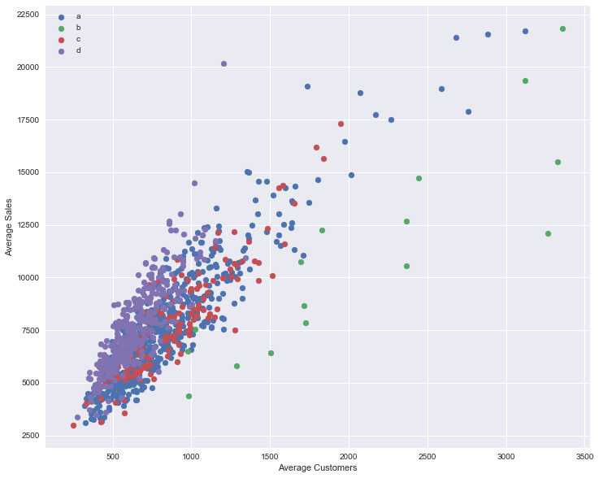

# Rossman Store Sales

Entry for NUS CS3244 Machine Learning's Kaggle Competition. 

Task is to predict sales given historical data.

I placed 2nd on the [leaderboard](https://www.kaggle.com/c/cs3244-rossmann-store-sales/leaderboard) (id falconets).

**Running**

You would need to install jupyter notebooks, sklearn, pandas and xgboost.

**Data Exploration**

I first explored the data for insights. (Please refer to the ipynb for graphs)

While opening the data, I found that there were many stores that were not open. Thus I confirmed that there were no closed stores with sales, and that there were no open stores with no sales and could safely remove them from the data set. 

Next, my intuition was that sales would scale with the number of customers on that day. Thus by plotting the trend, I was able to confirm that there was a correlation between customers and sales.

Continuing with this insight, I was able to separate them by the day of week, confirming that some days were correlating more strongly than others.

I noted that there were no easter holiday data set in state holidays, thus making any test data containing easter holiday harder to predict accurately.

Additionally, having promotions had an impact on sales, but school holidays did not impact sales much.

Next, I looked through the store data set, where I found that certain store types correlated better with sales and customers (graph below). The same case goes with assortment types.

Plot of Average Customer (X) vs Average Sales (Y) for different store types

Finally, competition distance versus sales was rather difficult to interpret, where it would seem that having closer distance would encourage sales, a rather intriguing scenario.

**Building Model (Lib: sklearn, pandas, xgboost)**

Given that many of the data set had discrete components such as day, week, day of week, year, assortment, store type, whether they had a promotion or not, it would seem that decision trees would be a good step to begin on.

A decision tree model would also enable me to realise the importance of certain features.  Which later proved my theory, as it did appear that customers had a big impact on sales, along with average sales per customer.

I continued with using ensemble methods such as Adaboost and Random Forest, which gave an improvement of 0.0608 and 0.0599 respectively on the validation set. Indeed, Random Forests’ variance decreased as compared to adaboost method.

Lastly, I was able to use the library I wanted to use when I started the module, XGBoost. XGBoost used gradient boosted trees, that gave great results with the existing data set. Interestingly, the features that XGBoost chose did not have the same ranking as other models.

**Feature Engineering**

I split the date into discrete components so the decision trees were able to make better guesses. I also tried using months since the competition has started and how long the store was in promotion since, but they were not able to get more improvements compared to using the original attributes in store.

Given that in the prior insight, that was a strong trend between sales and customers, I build three features - Average sales, customers and sales per customers. Given these features, I was able to get a good improvement in score.

Next, I tried using the median instead, but eventually I found that using both gave a better improvement.

**Parameter Tuning**

Next I followed the guide on parameter tuning on XGBoost. I did these manually with for loops as I was not able to get the GridSearchCV to work properly. I ended up changing multiple parameters such as min_child_weight, max_depth to get a miniscule improvement. Max_depth with 2 gave better performance than other figures, which was assuring as this meant overfitting was harder.

**What I learnt / What didn’t work**

* Feature engineering is utmost important, including ‘AvgSalesPerCustomer’ was able to give me an incredible increase in score. 

* Choosing your model is important, parameter tuning is secondary.

* Theory and practice may differ sometimes. Adaboost gave better score and variance sometimes versus Random Trees. I suspect this may be due to the importance of features being very skewed, and thus not hitting the more important features during selection would make scores worse.

* Average sales per month or per day of week did not give me an increase, most likely due to extrapolating data where there wasn’t any in test set, leading to overfitting. (E.g. June when data is Dec-Jan)

**Score**

Account name: falconets

Score: 0.6909 (n_estimators = 1000)

Score: 0.6832 (n_estimators = 3000)

**References**

[http://xgboost.readthedocs.io/en/latest/python/python_api.html](http://xgboost.readthedocs.io/en/latest/python/python_api.html)

[http://scikit-learn.org/stable/modules/tree.html](http://scikit-learn.org/stable/modules/tree.html)

[http://scikit-learn.org/stable/modules/ensemble.html](http://scikit-learn.org/stable/modules/ensemble.html)

[http://xgboost.readthedocs.io/en/latest/how_to/param_tuning.html](http://xgboost.readthedocs.io/en/latest/how_to/param_tuning.html)

[https://www.analyticsvidhya.com/blog/2016/03/complete-guide-parameter-tuning-xgboost-with-codes-python/](https://www.analyticsvidhya.com/blog/2016/03/complete-guide-parameter-tuning-xgboost-with-codes-python/)

[https://jessesw.com/XG-Boost/](https://jessesw.com/XG-Boost/)

[https://machinelearningmastery.com/develop-first-xgboost-model-python-scikit-learn/](https://machinelearningmastery.com/develop-first-xgboost-model-python-scikit-learn/)

[http://danielhnyk.cz/how-to-use-xgboost-in-python/](http://danielhnyk.cz/how-to-use-xgboost-in-python/)

